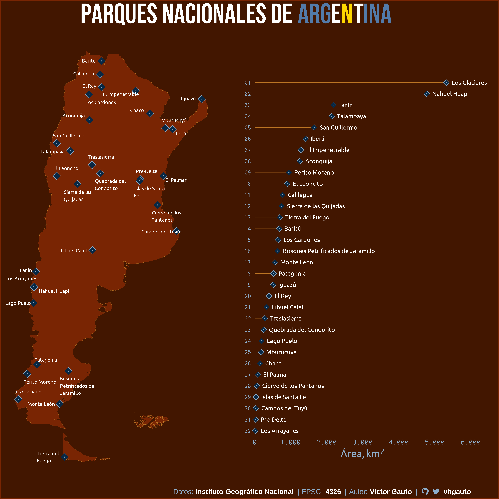
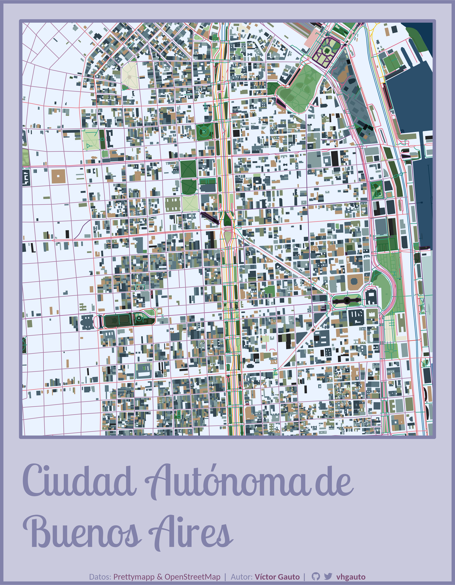

# Mis proyectos de visualización

Figuras creadas usando **R**, de datos que me parezcan interesantes. Mi repositorio de Tidytuesday lo encuentran [acá](https://github.com/vhgauto/tidytuesday).

## Parques Nacionales de Argentina

Datos del [Instituto Geográfico Nacional](https://www.ign.gob.ar/NuestrasActividades/InformacionGeoespacial/CapasSIG) de áreas protegidas de Argentina.

[Scripts](ign_parques/)

## Red vial Argentina

Datos del [Instituto Geográfico Nacional](https://www.ign.gob.ar/NuestrasActividades/InformacionGeoespacial/CapasSIG) de rutas a diferentes jurisdicciones.

[Scripts](ign_red_vial/)

## Popularidad de nombres en Argentina

Tomando como inspiración esta [figura](https://nombres.datos.gob.ar/), grafiqué la evolución en popularidad de los 10 nombres más frecuentes (femeninos y masculinos). El portal de datos de Argentina tiene un [gráfico interactivo](https://nombres.datos.gob.ar/).

[Scripts](nombres/)

2023-05-22

## Mapa de temperaturas mensuales en Argentina

Datos de temperatura mensual, desde enero 2020 a abril 2023, provenientes de [ERA5](https://cds.climate.copernicus.eu/cdsapp#!/dataset/reanalysis-era5-land-monthly-means?tab=overview). Basado en [este](https://www.youtube.com/watch?v=2VHuaFqtAsY) tutorial.

[Scripts](clima_temperatura/)

2023-05-15

## Prettymaps de las ciudades capitales de Argentina

Tomando de base los mapas generados por [Prettymapp](https://chrieke-prettymapp-streamlit-prettymappapp-1k0qxh.streamlit.app/), hice mi propia versión con las capitales argentinas.

[Scripts](pretty_map/)

2023-04-29

## Mapa topográfico de Argentina

Relieve continental y del lecho marino de Argentina, siguiendo este [tutorial](https://www.youtube.com/watch?v=zoLChBALc1k).

[Scripts](mapa_topografico/)

2023-04-19

## Rectangularidad de las provincias argentinas

Qué tan rectangulares son nuestras provincias. A partir de este post, ["The rectangularness of countries"](https://pappubahry.com/misc/rectangles/), y con modificaciones menores, obtuve los mismos resultados pero aplicado a nuestra región.

[Scripts](provincia_rectangulo/)

2023-04-15

## Animación de un corazón

Archivo .gif de un corazón.

[Script](corazon_gif/script__001.R)

2023-04-10

## Provincias ordenadas por su superficie

Se ordenan las provincias argentinas de acuerdo a su superficie, y se grafican manteniendo la escala, para comparar los tamaños de las provincias.

[Script](provincia_superficie/script__001.R)

2023-04-09
