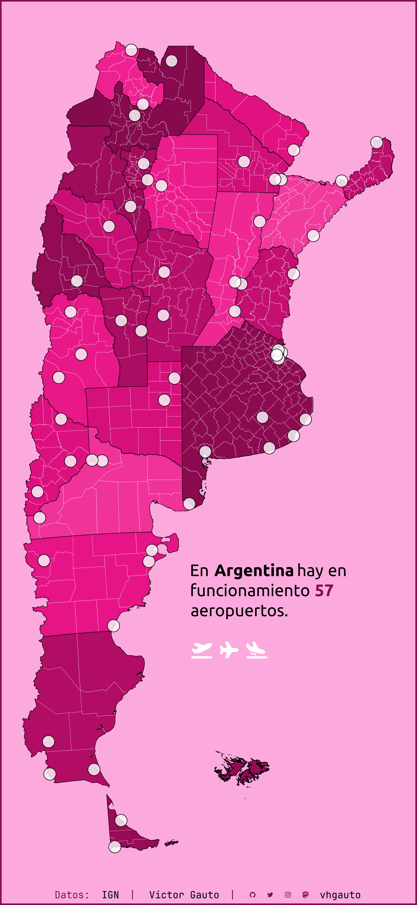
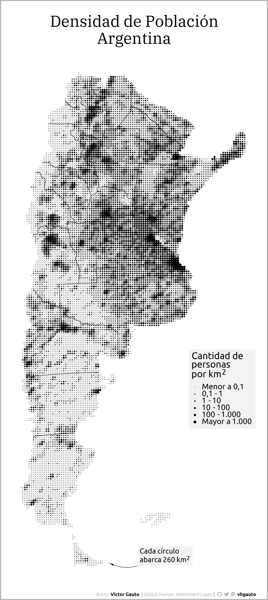

# Mis proyectos de visualización

Figuras creadas usando `R`, de datos que me parezcan interesantes. Mi repositorio de Tidytuesday lo encuentran [acá](https://github.com/vhgauto/tidytuesday).

## Animación de rutas nacionales y provinciales

Expansión de las rutas nacionales y provinciales a partir del Obelisco.

[Script](crecimiento_rutas/script.R)

https://github.com/user-attachments/assets/054a9e35-e422-47a9-a0f1-b868b6d06008

## Mapa bivariado de precipitación y temperatura

Promedio de los últimos 50 años de precipitación y temperatura, como mapa bivariado.

[Script](clima_bivariado/script.R)

2024-10-12

## Aeropuertos

Aeropuertos activos en Argentina.

[Script](aeropuerto/script.R)

2024-08-03

## Plantas de potabilizadoras de agua

Mapa de las plantas potabilizadoras de agua en funcionamiento.

[Script](planta_potabilizadora/script.R)

2024-08-03

## Torres de telefonía en Argentina

Animación del avance en la instalación de torres celulares en Argentina.

[Script](torres_celular/script.R)

https://github.com/vhgauto/viz/assets/45094467/8b8194b6-ffd1-4ed6-8bad-ace2f8a0466b

2024-04-07

## Faros en Argentina

Faros en las costas de Argentina, con topografía como mapa base.

[Script](faros/script.R)

2024-02-04

## Instituciones de ciencia y educación

Mapa de establecimientos dedicados al desarrollo de actividades educativas y 
científicas.

[Script](universidades/script.R)

2024-03-09

## Estaciones meteorológicas

Ubicación de las estaciones meteorológicas en Argentina.

[Script](estaciones_smn/script.R)

2024-02-17

## Elevación de CABA

Mapa de elevación de la Ciudad de Buenos Aires.

[Script](mapa_dem/script_001.R)

## Topografía de Argentina con emojis

Mapa de rangos de altura de Argentina, usando emojis de animales.

[Script](mapa_letras/script_001.R)

## Distribución de buzones en Argentina

Ubicación de buzones en Argentina, con detalle en Buenos Aires y Ciudad Autónoma de Buenos Aires.

[Script](buzones_arg/script_001.R)

## Topografía de Argentina utilizando líneas horizontales

Mapa del relieve de Argentina en estilo *joyplot*, o *ridgeline* (crestas).

[Script](mapa_ridges/script_001.R)

## Densidad de población de Argentina con puntos

Mapa de Argentina mostrando la distribución de la población.

[Script](mapa_puntos_pob/script_001.R)

## Argentina en la bandera Argentina

Bandera de Argentina con el mapa de Argentina, con las letras de Argentina.

[Script](arg_3x3/script_001.R)

## Chaco-Corrientes (relieve)

Imagen de Chaco, Corrientes y el puente sobre el Río Paraná.

[Script](mapa_relieve/script_puente.R)

## Ríos de Argetina

Datos de OpenStreetMap, descargados de [Geofabrik](https://download.geofabrik.de/south-america.html). A cada observación le asigné un color distinto, para generar un mapa pintorezco.

[Script](osm/script__001.R)

## Red Eléctrica de Argentina

Datos del [Instituto Geográfico Nacional](https://www.ign.gob.ar/NuestrasActividades/InformacionGeoespacial/CapasSIG) de líneas de energía y plantas transformadoras.

[Script](ign_electricidad/script__001.R)

## Parques Nacionales de Argentina

Datos del [Instituto Geográfico Nacional](https://www.ign.gob.ar/NuestrasActividades/InformacionGeoespacial/CapasSIG) de áreas protegidas de Argentina.

[Script](ign_parques/script__001.R)

## Red vial Argentina

Datos del [Instituto Geográfico Nacional](https://www.ign.gob.ar/NuestrasActividades/InformacionGeoespacial/CapasSIG) de rutas a diferentes jurisdicciones.

[Script](ign_red_vial/script__001.R)

## Popularidad de nombres en Argentina

Tomando como inspiración esta [figura](https://nombres.datos.gob.ar/), grafiqué la evolución en popularidad de los 10 nombres más frecuentes (femeninos y masculinos). El portal de datos de Argentina tiene un [gráfico interactivo](https://nombres.datos.gob.ar/).

[Script](nombres/script__001.R)

2023-05-22

## Mapa de temperaturas mensuales en Argentina

Datos de temperatura mensual, desde enero 2020 a abril 2023, provenientes de [ERA5](https://cds.climate.copernicus.eu/cdsapp#!/dataset/reanalysis-era5-land-monthly-means?tab=overview). Basado en [este](https://www.youtube.com/watch?v=2VHuaFqtAsY) tutorial.

[Script](clima_temperatura/script__001.R)

2023-05-15

## Prettymaps de las ciudades capitales de Argentina

Tomando de base los mapas generados por [Prettymapp](https://chrieke-prettymapp-streamlit-prettymappapp-1k0qxh.streamlit.app/), hice mi propia versión con las capitales argentinas.

[Script](pretty_map/script__001.R)

2023-04-29

## Mapa topográfico de Argentina

Relieve continental y del lecho marino de Argentina, siguiendo este [tutorial](https://www.youtube.com/watch?v=zoLChBALc1k).

[Script](mapa_topografico/script__001.R)

2023-04-19

## Rectangularidad de las provincias argentinas

Qué tan rectangulares son nuestras provincias. A partir de este post, ["The rectangularness of countries"](https://pappubahry.com/misc/rectangles/), y con modificaciones menores, obtuve los mismos resultados pero aplicado a nuestra región.

[Script](provincia_rectangulo/script__001.R)

2023-04-15

## Animación de un corazón

Archivo .gif de un corazón.

[Script](corazon_gif/script.R)

2024-02-14

## Provincias ordenadas por su superficie

Se ordenan las provincias argentinas de acuerdo a su superficie, y se grafican manteniendo la escala, para comparar los tamaños de las provincias.

[Script](provincia_superficie/script__001.R)

2023-04-09
